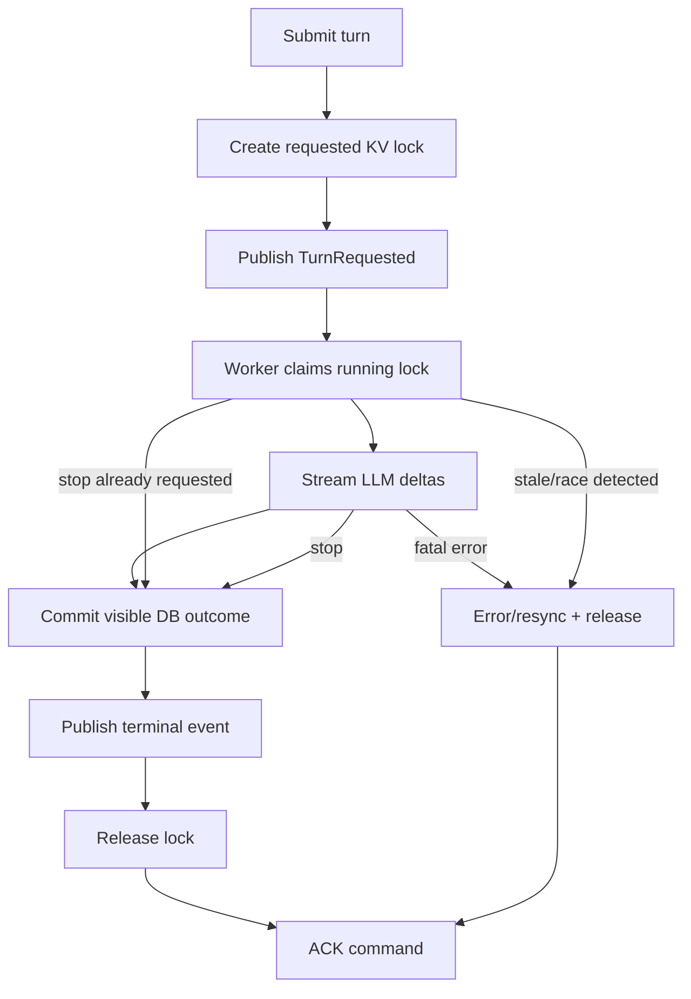

# Chat Failure Analysis

Crash behavior is documented as a failure matrix. The matrix is the source of
truth for recovery expectations; diagrams only show the common paths.

## API Crash Matrix

| Crash point | Durable state | Recovery | User-visible result | Required invariant |
| --- | --- | --- | --- | --- |
| Before auth/access completes | none | client retries | request fails or times out | no side effects before auth |
| After access check, before lock | none | client retries | request fails or times out | no accepted work without lock |
| After requested KV lock, before publish | requested lock only | lock lease/TTL expires | conversation may be temporarily `in_flight` | requested lock must expire |
| After publish, before HTTP response | lock + command | worker processes command | client may timeout, reload sees result | command is durable after PubAck |
| After HTTP `202` | lock + command | worker owns rest | normal stream or reload result | API does not need to stay alive |

The alteration under review moves transient requested state into `CHAT_LOCKS`
so an API crash does not leave orphan `chat_turn(status=requested)` rows.

## Worker Crash Matrix

| Crash point | Durable state | Recovery | User-visible result | Required invariant |
| --- | --- | --- | --- | --- |
| Before reading command | command pending | JetStream redelivers | no visible change | command not ACKed |
| After command read, before claim | requested lock | JetStream redelivers | no visible change | command not ACKed |
| After claim, before provider | running lock | lease expires, redelivery sees stale running | error/resync, user can reprompt | stale running must not silently regenerate |
| During LLM stream | running lock, live events may be visible | lease expires, redelivery marks failed/resync | stream stops, error/resync | partial visible stream is not treated as committed truth |
| After DB commit, before finish event | committed DB state | redelivery reads committed truth or resyncs | reload shows committed answer | DB commit precedes terminal event |
| After finish event, before DB commit | invalid ordering | avoid by design | not allowed | terminal event must never precede DB commit |
| After DB commit + finish, before ACK | committed DB state, command unacked | redelivery ACKs without rerun | no duplicate answer | terminal state is idempotent |
| After lock release, before ACK | committed/interrupted/failed outcome | redelivery ACKs without rerun | no duplicate answer | release only after terminal handling |

## Redelivery Decision Table

| Observed state on redelivery | Action |
| --- | --- |
| No lock, committed DB outcome exists | ACK and skip |
| Requested lock for same `turn_id` | claim and process |
| Running lock with fresh lease | do not process; do not final ACK |
| Running lock with stale lease | mark failed or require resync; ACK after terminal handling |
| Stop flag set before provider start | commit interrupted/failed stop outcome without LLM call |
| Terminal committed/interrupted/failed outcome exists | ACK and skip |

## Ordering Invariants

- Only one active lock may exist per conversation.
- A successful API response requires a PubAck for the command.
- A terminal realtime event is published only after DB commit succeeds.
- The worker final-ACKs the command only after terminal handling.
- Stale running turns do not silently regenerate a different answer.
- Stop is scoped to tenant, conversation, and turn.
- Realtime subscription is authorized before NATS events are consumed.

## Saga View

