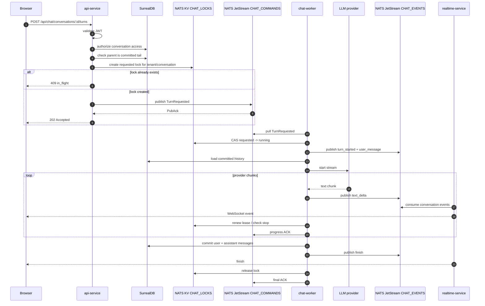
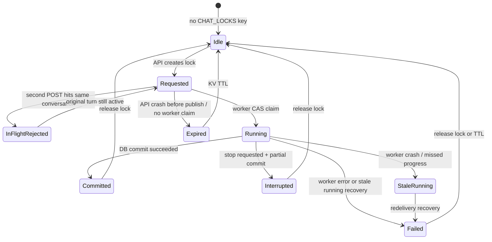
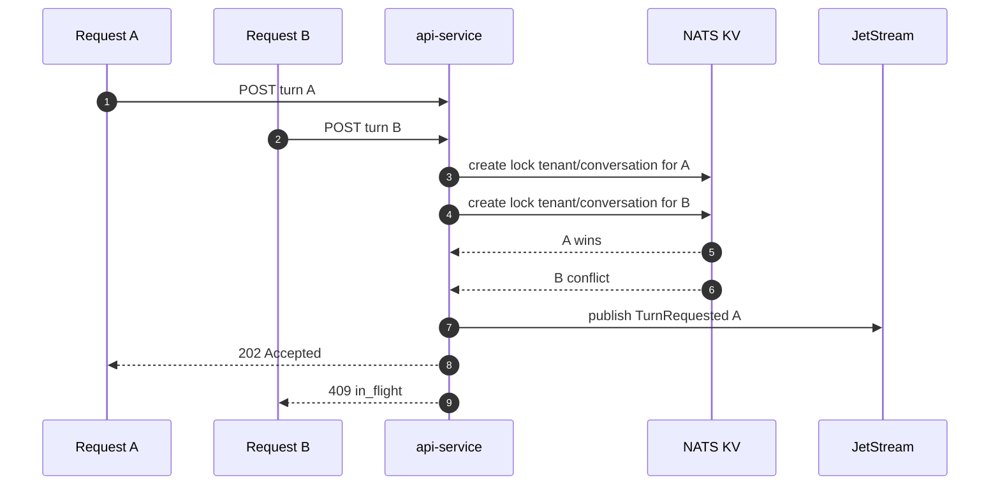

# Chat Request Flow

This page describes what happens when a user submits a chat message.

## Happy Path



## Active Turn State



## Concurrent POST Race

Two users, tabs, or devices can submit against the same conversation at the
same time. The KV create is the serialization point.



Invariant: only one active turn per conversation can be published as accepted.

## Stop Flow

```mermaid
sequenceDiagram
  autonumber
  participant Browser
  participant API as api-service
  participant DB as SurrealDB
  participant KV as NATS KV CHAT_LOCKS
  participant Control as NATS Core control subject
  participant Worker as chat-worker
  participant Events as CHAT_EVENTS
  participant RT as realtime-service

  Browser->>API: POST /api/chat/conversations/:id/stop
  API->>DB: authorize conversation access
  API->>KV: CAS stop_requested=true
  alt lock is running
    API->>Control: publish chat.control.tenant.conversation.stop
  else lock is requested
    API->>API: no wakeup; worker sees flag on claim
  end
  API-->>Browser: 204
  Control-->>Worker: stop wakeup
  Worker->>KV: verify stop_requested + active turn
  Worker->>Events: publish interrupted
  Worker->>DB: commit user + partial assistant interrupted
  Worker->>KV: release lock
  RT-->>Browser: interrupted event
```

The HTTP `204` only means the stop request was accepted. The browser learns
that streaming actually stopped from the `interrupted` realtime event.
