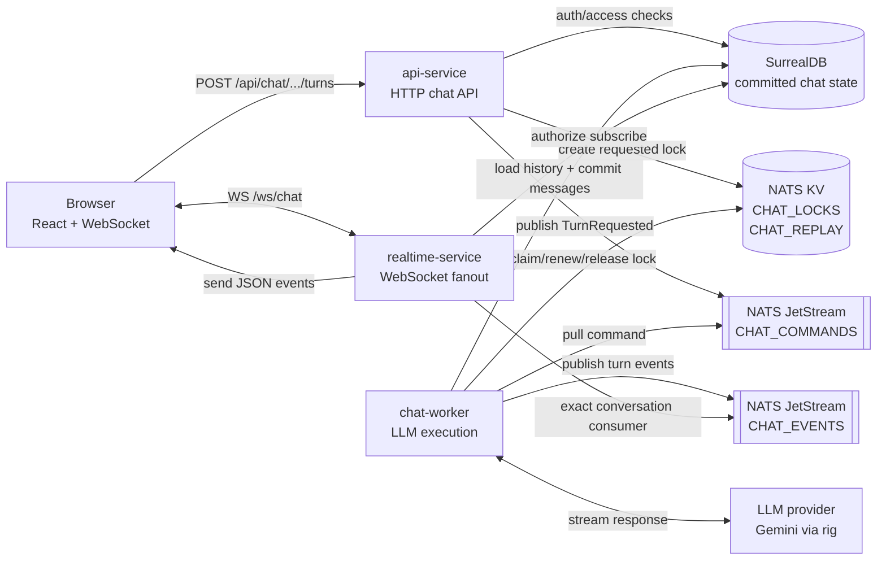
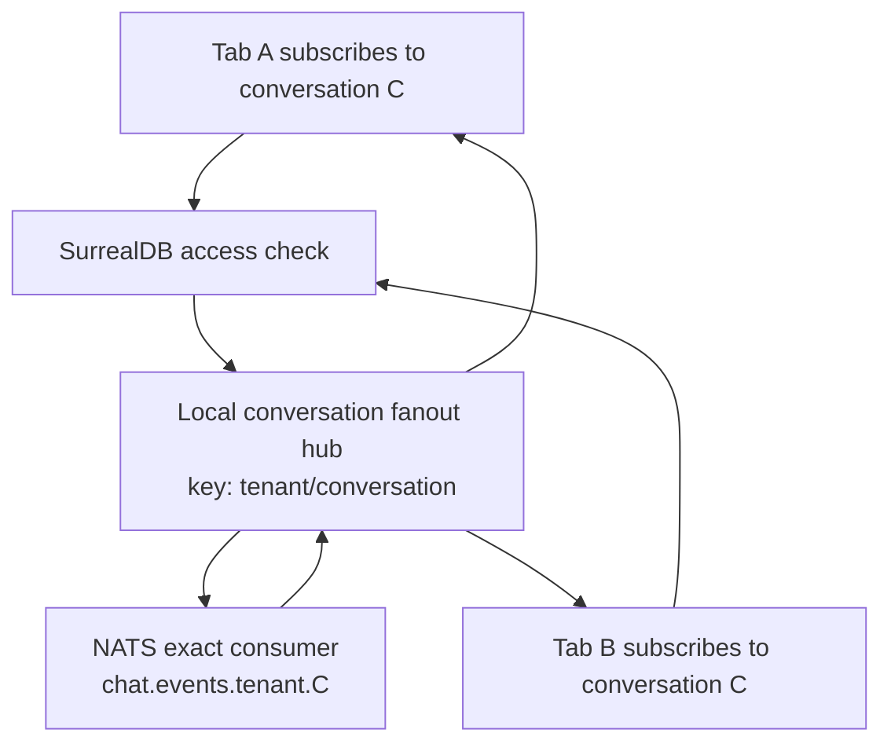

# Chat System

The chat system is split into small services connected by NATS and SurrealDB.
The API handles authenticated commands, the worker owns LLM execution, and the
realtime service only relays authorized live events to browser tabs.



## Runtime Responsibilities

| Component | Owns | Does not own |
| --- | --- | --- |
| `api-service` | auth, access checks, command acceptance, active lock creation | LLM execution, WebSocket delivery |
| `chat-worker` | active turn execution, LLM stream, DB commit, terminal event | browser connections |
| `realtime-service` | WebSocket sessions, replay, local fanout | command execution, LLM calls |
| SurrealDB | committed conversation/message truth | transient active-turn coordination |
| NATS JetStream/KV | commands, live events, active locks, replay cursors | long-term chat history |

## Event Subjects

```text
chat.commands.turn_requested
chat.events.<tenant_id>.<conversation_id>
chat.control.<tenant_id>.<conversation_id>.stop
```

The realtime service subscribes to exact conversation event subjects only
after SurrealDB authorizes the user for that conversation.



Multiple tabs on the same realtime replica share one local fanout hub and one
exact NATS consumer.
